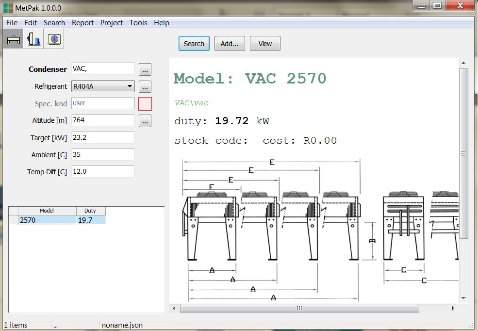
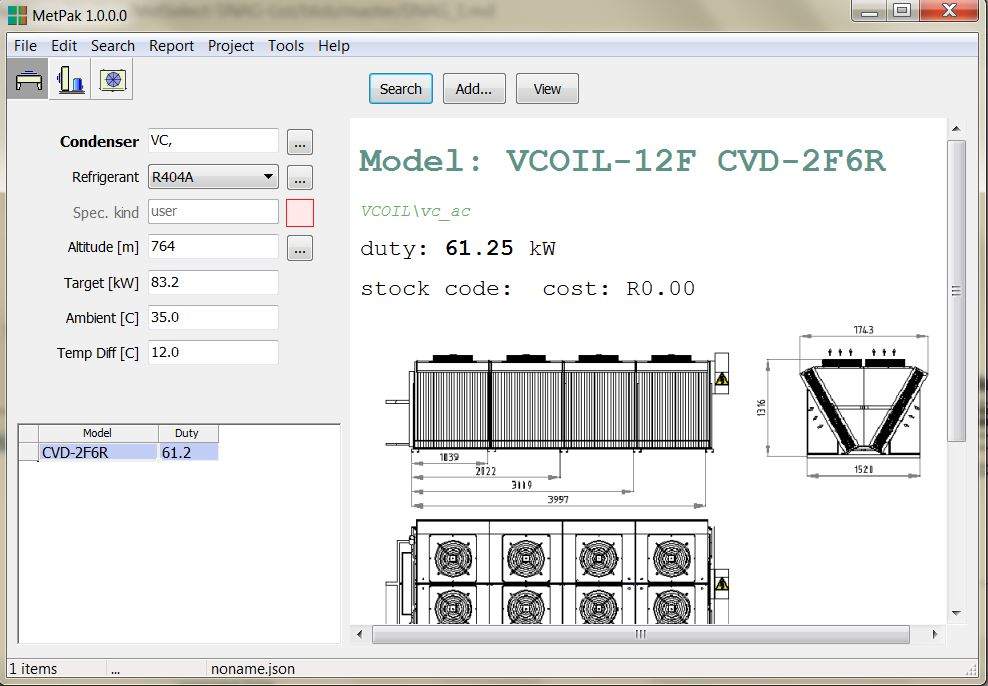

# Created : 25/09/2018 / Author - N du Plessis
#### Last Updated : 04/10/2018 / Author - N du Plessis

##  #1 **_Condenser Selection Below Targeted Value_**

**Issue:** Stating that a condenser is required with 69.2kW of THR
Coil with less capacity wasa supplied.

## Fixed by Bruce Wernick 11 March 2019.

The search has a tolerance of 1% under and 15% over the target.

If no models are within tolerance, the program returns the closest match.

The problem is that the closest match might be under the target duty.

I have fixed the problem by creating a list of models around the target.

**HAC**

**VAC**

**V-Coil**

