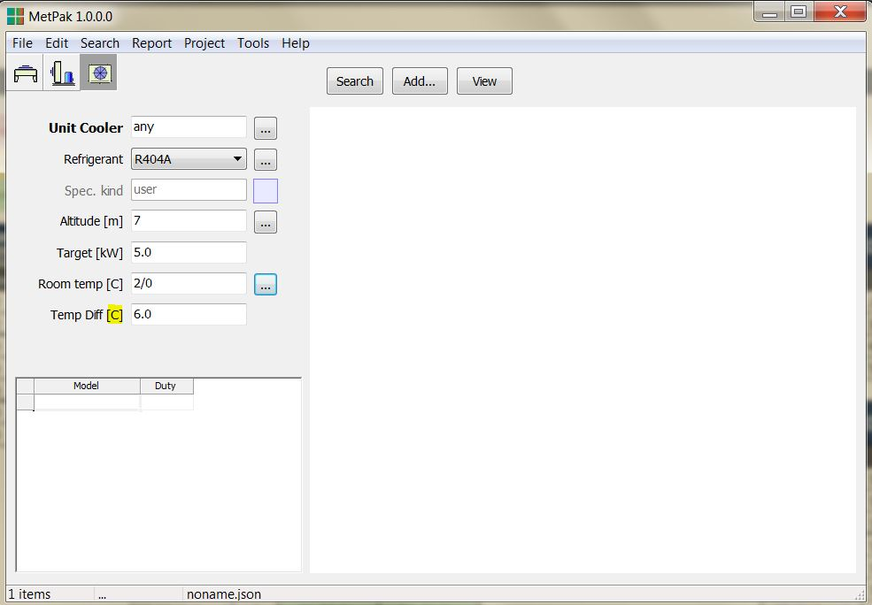
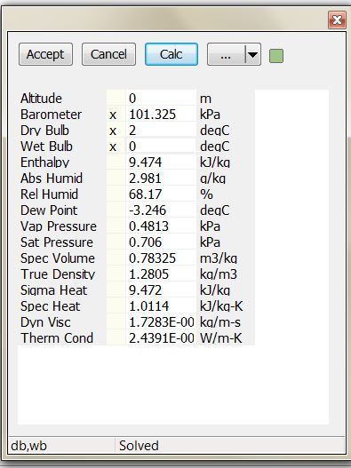

# Created : 05/10/2018 / Author - N du Plessis
#### Last Updated : 05/10/2018 / Author - N du Plessis

##  #11 **_Temperature indication on Unit Cooler Form_**

**Issue:** Unit Cooler Temperature display as db / wb will confuse the salesmen.

### This is not an error

The user can enter just dry bulb and the program will automatically calculate the correct wet bulb.

The reason the db/wb is needed is for the case where the user NEEDS to specify the full air state.

 **Result:** Unit Cooler Selection Temperature to be just db temperature (room temp), no need to go into 
 the unit cooler air state conditions, **_if possible_**
