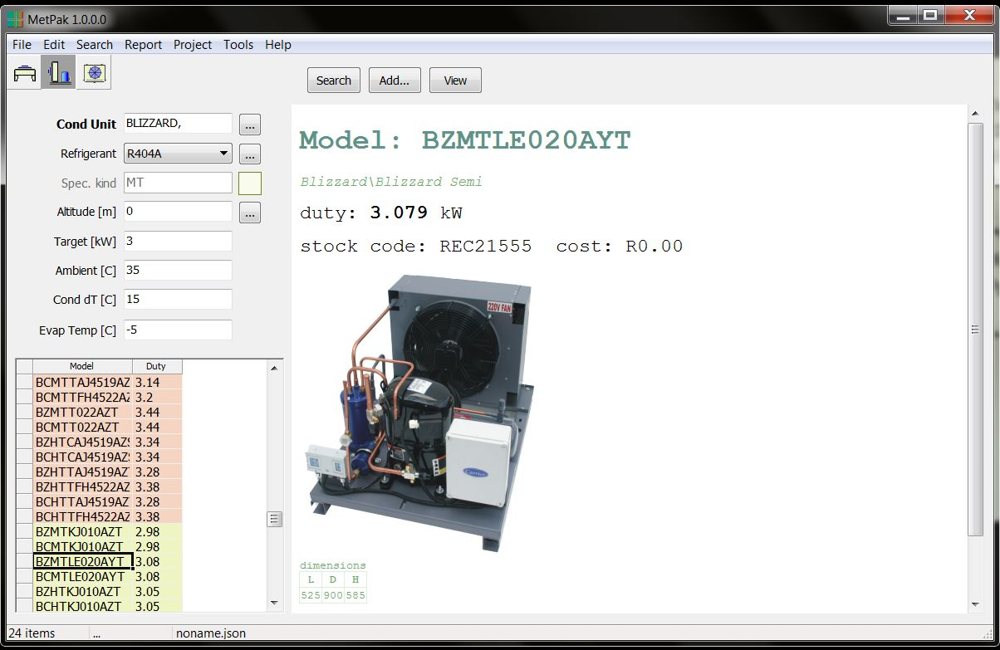

# Created : 09/10/2018 / Author - N du Plessis
#### Last Updated : 09/10/2018 / Author - N du Plessis

##  #18 **_Compressor Product Selection - Select between compressor types_**

**Issue:** All the different compressor options given in the search.

### Fixed.

Compressor type combo added to Cond Unit criteria form.
...

**Result:** Give the option to select between Reciprocating Compressor, Scroll Compressor or Semi-Hermetic Compressor

Give the option to the user whether they would like to select an inland or coastal unit, default being inland

Option only suitable for the Blizzard units & Dynapack units, as it is the only units with this option

