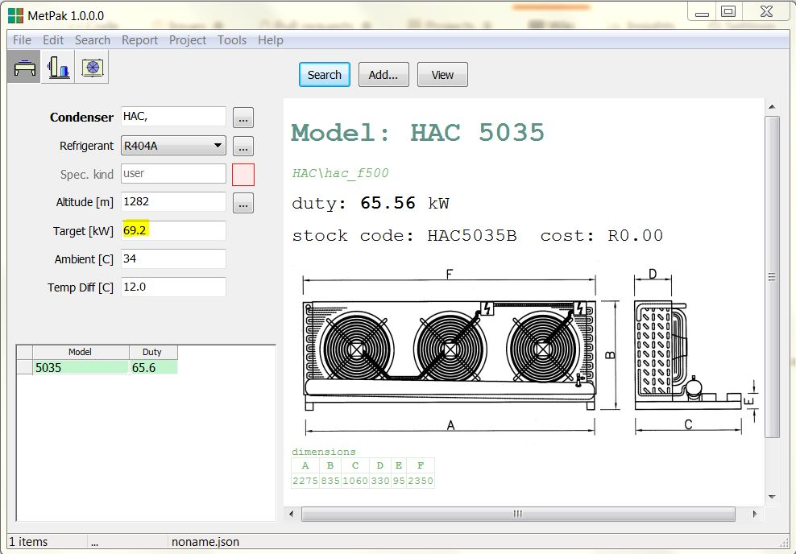

# Created : 25/09/2018 / Author - N du Plessis
#### Last Updated : 26/09/2018 / Author - N du Plessis

##  #2 **_Condenser Selection Search only delivered single unit_**

**Issue:** Stating that a condenser is required with 69.2kW of THR, the tool selected a single coil with less capacity than the required 
capacity.

###Update
Fixed with snag item 1

**Requierment:** In some instances the software has multiple options, but in this case it shows only one, we would like a minimum of 
3 units, per range, to be selectable

**Example:** Currently used by MTC, as an example

