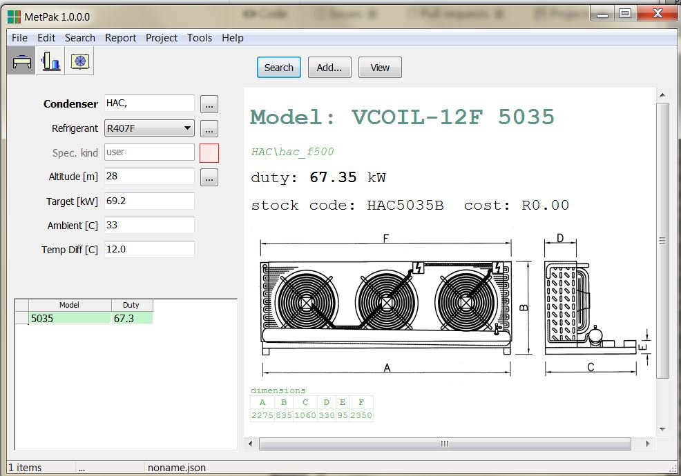
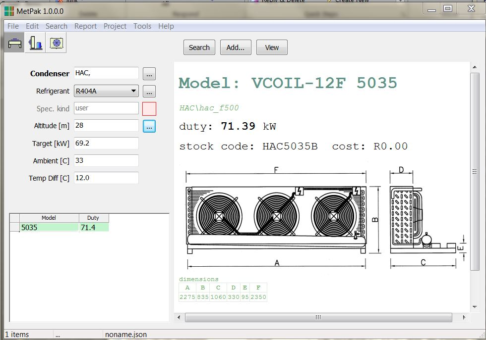

# Created : 04/10/2018 / Author - N du Plessis
#### Last Updated : 04/10/2018 / Author - N du Plessis

##  #5 **_Capacity discrepancy between refrigerants_**

**Issue:** Condenser capacity lower on R407F compared to R404A.

**R407F - Recam Catalogue HAC5035 at sea level _69.07kW THR_**

**R404A  - Recam Catalogue HAC5035 at sea level _68.67kW THR_**

**Result Example:** R407F capacity to be higher than R404A

**Catalogue:** Recam Condenser Catalogue Refrigeration Capacity Values
