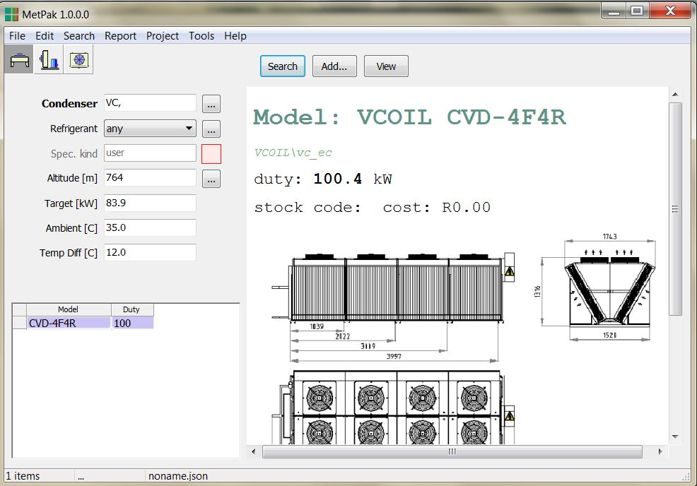

# Created : 04/10/2018 / Author - N du Plessis
#### Last Updated : 04/10/2018 / Author - N du Plessis

##  #7 **_Different Capacity for same unit_**

**Issue:** Different capacities supplied for the same V-Coil unit.

**Selection 1**

**Selection 2**

