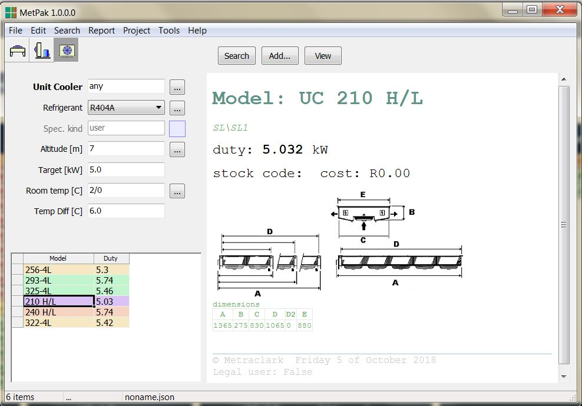

# Created : 05/10/2018 / Author - N du Plessis
#### Last Updated : 05/10/2018 / Author - N du Plessis

##  #8 **_No model differentiation in unit cooler model selection bar_**

**Issue:** No model differentiation in model selection bar, only seen when a unit is selected as per file it was collected in.

### Fixed by Bruce Wernick 12 March 2019

I have added the model prefix. 
Now the full model name is shown in the list.

**Result Example:** Units to be stated as example : SU322-4L or SL210H
